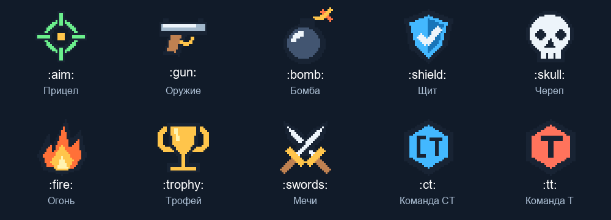

# Игровые значки — 1.4.3-gaming-dev

В наборе ровно десять значков. Это собственная пиксельная графика 32 × 32, а не системный шрифт emoji. Снимок выше собран из готового chars.spr; это не кадр из игры.

| Код ввода | Значок |
|---|---|
| :aim: | Прицел |
| :gun: | Оружие |
| :bomb: | Бомба |
| :shield: | Щит |
| :skull: | Череп |
| :fire: | Огонь |
| :trophy: | Трофей |
| :swords: | Скрещённые мечи |
| :ct: | Команда CT |
| :tt: | Команда T |

## Как проверить

1. Установите четыре плагина из одного архива и новый каталог sprites/SprLett/Charsets/Gaming_v1 (оба файла). Старые Default/Test менять не нужно.
2. Добавьте Gaming_v1/chars.spr на FastDL с тем же путём; смените карту.
3. В консоли администратора: slcreate :ct: READY :aim: :bomb: :tt:
4. slplace ставит выбранную надпись на поверхность. slpanel 256 64 3 добавляет рамку на костях; slsave сохраняет.
5. В slmainmenu → «Цвет, шрифт и другие действия» → «Добавить игровой значок» можно дописывать значки в конец текста. Короткая команда: slemoji.
6. Меняйте текст через slwrite или обычный пункт «Изменить текст». Коды работают также в slmarqueetext и серверной sl_marquee_text.

Не нужно переключать весь шрифт: для известных значков движок получает Gaming_v1 автоматически, буквы остаются в выбранном наборе. Сам Gaming_v1 также содержит все 157 исходных букв/знаков Default. Всего 167 кадров, без выхода за сетевой предел 256.

Цветные значки используют белый оттенок и режим отображения с прозрачной текстурой; цвет и режим остальных букв регулируются как прежде. Общая прозрачность слова действует на значки. Градиент пропускает значки. В бегущей строке после ухода значка ячейка возвращается к основному цвету слова; индивидуальный временный градиент этого места не сохраняется. Команда slgradient — необязательный демонстрационный эффект, а не сохраняемый стиль.

Коды чувствительны к регистру. Доступны также одиночные символы 🎯 🔫 💣 🛡 💀 🔥 🏆 ⚔ 🔵 🔴; для щита/мечей допускается стандартный emoji-селектор. Это фиксированный набор; составные emoji, флаги и оттенки кожи не поддерживаются. Предел текста прежний: 127 байт UTF-8 на входе; один значок занимает 3–4 байта после преобразования. Сохранения содержат уже преобразованные символы.

## Выполнено

- Сборка всех четырёх AMXX: без ошибок/предупреждений, Compiler 1.10.0.5461.
- Проверены 167 кадров, все 10 соответствий код ↔ символ ↔ кадр, прозрачность и ограничения UTF-8. Исходные буквы внутри нового набора сохраняют RGB без погрешности.
- Старые ресурсы остаются побайтно прежними. Новый набор имеет отдельный путь, поэтому кеш старых клиентов не перезаписывается.
- Исходники прочитаны по цепочкам создания, меню, загрузки, прокрутки и изменения цвета. Pawn и отрисовка GoldSrc в этих проверках не запускались.

## Проверить в игре

- [ ] Смешанная надпись, все 10 значков и добавление через меню.
- [ ] Цвет/прозрачность текста: значки сохраняют собственную палитру, тёмные детали видны.
- [ ] Бегущая строка: после значка обычная буква восстанавливает цвет и режим отображения.
- [ ] slsave → смена карты: надпись, значки и рамка восстановлены.
- [ ] Клиент со старыми ресурсами скачивает Gaming_v1/chars.spr и frame_bones_v1.mdl.

На действующем сервере эта работа ничего не меняет: опубликован кандидат для проверки.
